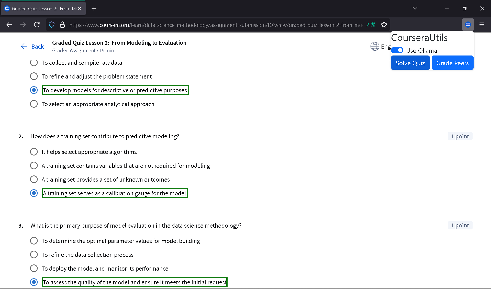

# Coursera Utilities

A Firefox extension to auto-grade peers and solve quizzes using a chat completion model

## Installation

- Go to [about:debugging#/runtime/this-firefox](about:debugging#/runtime/this-firefox)
- Click on "Load temporary add-on"
- Navigate to the extracted repo folder and load the manifest.json file

## Acknowledgements

 - [vuchuduy112's coursera-toolkit](https://github.com/vuduchuy1120/cousera-toolkit)
 - [amirreza1307's coursera autoanswer](https://github.com/amirreza1307/coursera-auto-answer)